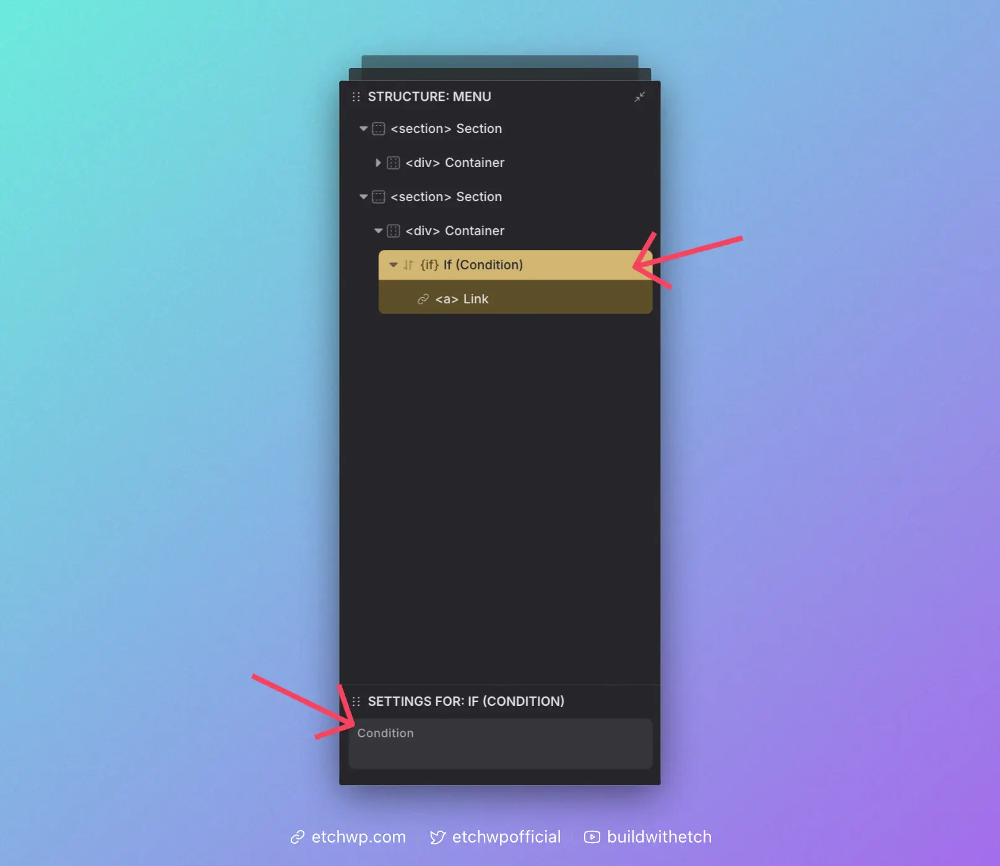

# Basic Conditions 

The simplest conditions to start with are simple single condition `if` statements.

All you have to remember is that you're programming logic to _**show**_ the elements inside the condition. Of course, if that condition doesn't resolve to showing the element, then the element is effectively hidden.

The process is simple. Ask yourself two questions:

1. What data do I want to check?
2. Should I write the statement as positive or negative to show the element?

One of the simplest conditions is based on showing a `logout` link if the user is logged in, and a `login` link if the user is logged out. Doing this as an exercise will help you understand exactly how simple `if` conditions work.

Let's ask ourselves the two questions:

- **What data do I want to check?**: In this case, we want to check the [Dynamic Data Key](/dynamic-data/dynamic-data-keys), `user.loggedIn`.
- **Should I write the statement as positive or negative to show the element?**: In this case, we want to write it as a positive to show the logout link and as a negative to show the login link.

## Conditional Logic With the UI

Add a condition element to the page by clicking the Condition Element icon:


You'll see the condition element in the structure panel. Add a link element inside of it.

When you click the condition element in the structure panel, you'll also see an exposed Attribute panel for it. It looks like this:



When using the UI like this, you have to remember that the `{#if}` was already written for you. So all you're doing is checking the data.

For the "is user logged in" check, all you have to do is write the literal dynamic data key in the box:

```
user.loggedIn
```

In the code, this outputs as:

```html
{#if user.loggedIn} 
  <!-- logout link -->
{/if}
```

You don't have to do this: `{#if user.loggedIn == true}` because a boolean check is implied for boolean values.

Now, let's tackle the "is user **not** logged in" side of things. 

Add another condition block (outside of the first one) and put another link inside of it. This will be for the "login" link (since the user is logged out if this condition is true).

Ask yourself the two questions again:

- **What data do I want to check?**: Once again, we want to check the [Dynamic Data Key](/dynamic-data/dynamic-data-keys), `user.loggedIn`.
- **Should I write the statement as positive or negative to show the element?**: In this case, we want to write it as a negative so that it resolves to true (and shows our element) if the user is not logged in.

How do we check if it's false? By putting a "!" in front of the key.

```
!user.loggedIn
```
That's it!

You've now created two very basic conditions for a very common scenario in web design!

And since conditions are blocks in the editor, you are free to drag whatever elements you want into either condition. It's very flexible. You don't need one condition per element – a single condition can control an entire collection of elements.

## Non-Boolean Conditions

If you need to check a specific value, like the value of a custom field, then you will use the `==` and `!=` operators. You can also use math operators like `>`, `<`, `>=`, or `<=`. 

For this example, let's say you're creating a star rating component. We'll keep it simple and say the rating can be whole numbers from 1 to 5.

In your component, create a prop called "rating." This is where we'll place the number and this is the prop we'll check the value of in the condition.

One way to do this would be to create five conditions that all check the rating value. If the rating equals 1, show one star. If the rating equals 2, show two stars.

That would look like this:

```html
{#if props.rating == "1"}
  <!-- Star 1 -->
{/if}
{#if props.rating == "2"}
  <!-- Star 1 --> <!-- Star 2 -->
{/if}
{#if props.rating == "3"}
  <!-- Star 1 --> <!-- Star 2 --> <!-- Star 3 -->
{/if}
```

...you get the point.

Perhaps a more efficient way to do it would be "greater or less than specific value" checks.

```html
{#if props.rating >= 1}
  <!-- Star -->
{/if}
{#if props.rating >= 2}
  <!-- Star -->
{/if}
{#if props.rating >= 3}
  <!-- Star -->
{/if}
{#if props.rating >= 4}
  <!-- Star -->
{/if}
{#if props.rating >= 5}
  <!-- Star -->
{/if}
```

There's two very important and distinct differences here that you need to examine.

1. We're checking a VALUE (math) instead of a STRING (text).
2. This is denoted by removing the quotations around the value.

Look closely:

`{#if props.rating == "2"}` says, "Show the element if the value of `props.rating` literally says "2".

But when you write `{#if props.rating >= 2}`, Etch can actually calculate the value and see if the condition is true, because it knows that 2 is equal to 2. And the condition that comes before it, `{#if props.rating >= 1}` will also be true because Etch knows that 2 is greater than 1.

You would never write `{#if props.rating >= "2"}` because "greater or equal" is irrelevant when examining a string of text. Again, putting the quotes around the number tell Etch that you want to examine "2" as a string, and not a numerical value.

That's a critical distinction that many beginners get wrong.

## Practice Makes Perfect

The first step to learning how to use conditions is to not be afraid of them.

Conditional logic is a critical piece of advanced web development and personalized web experiences. Once you've used them a few times, you'll quickly get comfortable. And once you get comfortable, things get really fun!

As always, if you get stuck, don't hesitate to ask for help in the [Etch Community](https://community.etchwp.com).