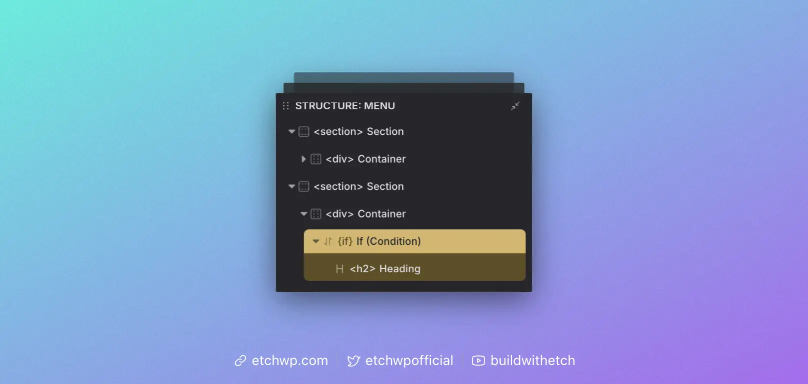

# Intro to Conditional Logic

Conditional logic is a programming concept that enables your website to show different content or behave differently based on specific conditions. Think of it as the "if this, then that" system that makes your website intelligent and personalized.

In web design, conditional logic allows you to:
- Show different content to different users
- Display content only when certain conditions are met
- Create dynamic layouts that adapt to available content
- Build personalized user experiences

## How Conditional Logic Works in Etch

In Etch, conditional logic is created using our Condition element or by writing conditions directly into the HTML code.


The condition element is essentially just a shortcut to writing this in the HTML Editor:

```html
{#if}{/if}
```

Both methods will create the condition in the code as well as expose a Condition block in the Structure Panel:



Whatever goes inside the condition will render on the page if the condition resolves to true.

## Common Conditional Logic Patterns

### 1. **Content Existence Checks**
Show content only when it exists:
- Display featured images only when they're uploaded
- Show author bio only when author has a bio in the database
- Display "Read More" button only when there's an excerpt
- Show category tags only when categories are assigned

### 2. **User Authentication States**
Adapt content based on user login status:
- Show login/logout links based on logged in status
- Display user avatar and name in header when authenticated
- Display personalized welcome message for returning users

### 3. **Content Type & Status Conditions**
Display different layouts based on content:
- Show "Featured" badge only for featured posts
- Show "New" indicator for posts published in last 7 days
- Show/hide content for premium/paid subscribers

## Getting Started

Conditional logic in Etch is very easy to implement. We'll walk you through using both basic and advanced conditions so you feel like a pro in no time. And so you can create intelligent, responsive websites that provide the right experience to the right user at the right time. 