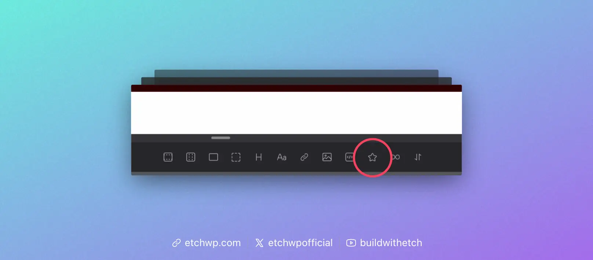

# Element

The **Element Element** in Etch is a special element that allows you to dynamically change the tag while keeping attributes, classes, and other settings intact.

To get started, add the Element Element to the page by clicking it in the **Elements Bar** while editing a Component.

:::info
Although the button for adding the Element Element only appears while editing a Component, the Element itself is not exclusive to Components and can be placed anywhere in your structure. In most cases, however, you will use it within Components.
:::

In the code editor you will see `<etch:element>`, but the output on the front-end will be whatever tag you assign it.

In the Attributes Panel, with the Element Element selected, you can choose a tag from the dropdown or enter a custom tag manually.

Alternatively, you can set the tag using the HTML editor by specifying the `tag` attribute, like so:  
`<etch:element tag="div">`

## Using the Element Element with Components

The **Element Element** can be used in Components via a simple text prop.

For example, create a text prop called `headingLevel`, and then place `h{props.headingLevel}` (or whatever your prop key is) in the **Tag** field for the Element Element.

You can now control the rendered heading level from outside the Component.

Another good approach is to use a **Select prop**, allowing you to define a predefined list of valid tags that can be selected.

## Selector/Attribute Support

The **Element Element** is compatible with any valid CSS selector and HTML attributes.